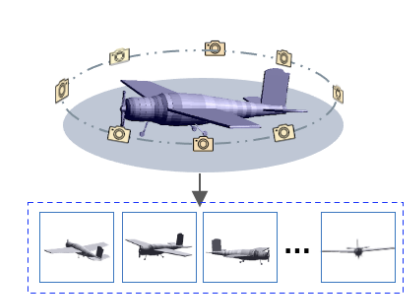

# MVTorch
A modular Pytroch library for multi-view research on 3D understanding and 3D generation.
# Introduction

MVTorch provides efficient, reusable components for 3D Computer Vision and Graphics research based on mult-view representation with [PyTorch](https://pytorch.org) and [Pytorch3D](https://github.com/facebookresearch/pytorch3d).

### Key Features include:

- Render differentiable multi-view images from meshes and point clouds with 3D-2D correspondances.
- Data loaders for 3D data and multi-view images (posed or unposed )
- Visualizations of 3D mesh,point cloud, multi-view images. 
- Modular training of multi-view networks for different 3D tasks 
- I/O 3D data and multi-view images. 


### Benifits :

- Are implemented using PyTorch tensors and on top of Pytorch3D 
- Can handle minibatches of hetereogenous data
- Can be differentiated for input gradients.
- Can utilize GPUs for acceleration


## Installation

```bibtex
pip install mvtorch
```
For detailed instructions refer to [INSTALL.md](INSTALL.md).

## Tutorials

Get started with MVTorch by trying one of the following examples.


| | |
|:-----------------------------------------------------------------------------------------------------------:|:--------------------------------------------------:|
| [Training MVCNN in 10 lines of code for ModelNet40 3D classification](https://github.com/ajhamdi/mvtorch/blob/main/examples/classification.py)| [Training 3D segmentation on ShapeNetParts with Multi-View DeepLabV3](https://github.com/ajhamdi/mvtorch/blob/main/examples/segmentation.py) |


| | |
|:-----------------------------------------------------------------------------------------------------------:|:--------------------------------------------------:|
| [               Fit A Simple Neural Radiance Field                       ](https://github.com/ajhamdi/mvtorch/blob/main/examples/nerf.py)| [              Create Textured Meshes from Text              ](https://github.com/ajhamdi/mvtorch/blob/main/examples/text2mesh/run.py) |


### Key Classes
- [**MVRenderer**](https://github.com/ajhamdi/mvtorch/tree/fc83d72c1f43e977b61db91984eb6731bdcaaed6/mvtorch/mvrenderer.py#L25) ( renders multi-view images of both point clouds and meshes )
- [**MVNetwork**](https://github.com/ajhamdi/mvtorch/tree/fc83d72c1f43e977b61db91984eb6731bdcaaed6/mvtorch/networks.py#L6) ( allow to take any 2D network as input and outputs its multi-view features)
- [**visualizer**](https://github.com/ajhamdi/mvtorch/tree/fc83d72c1f43e977b61db91984eb6731bdcaaed6/mvtorch/visualizer.py#L4)  ( handles multi-view and 3D visualization both for server saves and interactive visualization)
- [**data I/O**](https://github.com/ajhamdi/mvtorch/blob/main/mvtorch/data.py) ( load any dataset: modelnet, shapenet, scanobjectnn, shapenet parts, s3dis, nerf, as well as saving Multi-view datasets.)
- [**viewSelector**](https://github.com/ajhamdi/mvtorch/tree/fc83d72c1f43e977b61db91984eb6731bdcaaed6/mvtorch/view_selector.py#L300) ( multi-view selector to select M viewpoints to render: random, circular ,spherical, [mvtn](https://github.com/ajhamdi/MVTN)  etc ... )
- [**MVAggregate**](https://github.com/ajhamdi/mvtorch/blob/fc83d72c1f43e977b61db91984eb6731bdcaaed6/mvtorch/mvaggregate.py#L70) ( a super model that accepts any 2D network as input and outputs the global multi-view features of input multi-view images: MeanPool, MaxPool) 
- [**MVLifting**](https://github.com/ajhamdi/mvtorch/blob/fc83d72c1f43e977b61db91984eb6731bdcaaed6/mvtorch/mvaggregate.py#L196) ( aggregates dense features from multi-view pixel features to 3D features  , eg. LabelPool, MeanPool, [Voint](https://arxiv.org/abs/2111.15363) aggregation and lifting ) 
- other useful utility functions and operations.

## Development

We welcome new contributions to MVTorch by following this procedure for pull requests: 

- For code modifications, create an issue with tag `request` and wait for 10 days for the issue to be resolved.

- If issue not resolved in 10 days, fork the repo and create a pull request on a new branch. Please make sure the main [examples](https://github.com/ajhamdi/mvtorch/tree/main/examples) can run after your adjustments on the core library.

- For additional examples, just create a pull request without creating an issue. 

- If you can contribue regularly on the library, please contact [Abdullah](abdullah.hamdi@kaust.edu.sa) to be added to the contruters list.


## Citation

If you find mvtorch useful in your research, please cite the extended paper:

```bibtex
TPAMI paper once uploaded to arxiv
```

```bibtex
@InProceedings{Hamdi_2021_ICCV,
    author    = {Hamdi, Abdullah and Giancola, Silvio and Ghanem, Bernard},
    title     = {MVTN: Multi-View Transformation Network for 3D Shape Recognition},
    booktitle = {Proceedings of the IEEE/CVF International Conference on Computer Vision (ICCV)},
    month     = {October},
    year      = {2021},
    pages     = {1-11}
}
```

## News

**[July 23 2022]:**   MVTorch repo created
**[January 1 2023]:**   MVTorch made public


## Projects
Projects that use MVTorch functions:  [MVTN](https://arxiv.org/abs/2011.13244) and [Voint Cloud](https://arxiv.org/abs/2111.15363). Projects that MVTorch benifited from in devlopment: [Text2Mesh](https://github.com/threedle/text2mesh), [NeRF](https://github.com/yenchenlin/nerf-pytorch)

## Documentation

A detailed documentation of the library should be coming soon... 

### Overview Video
Coming soon ...

## License

MVTorch is released under the [BSD License](LICENSE).